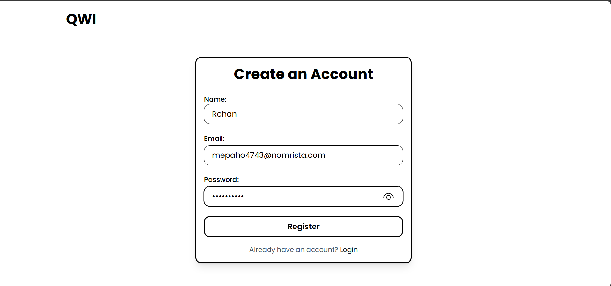
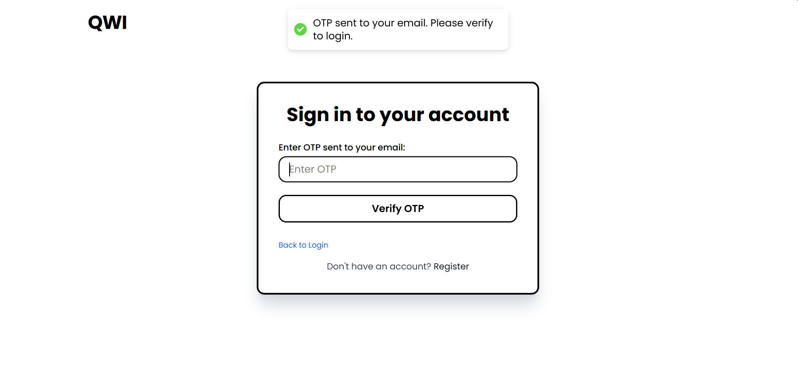
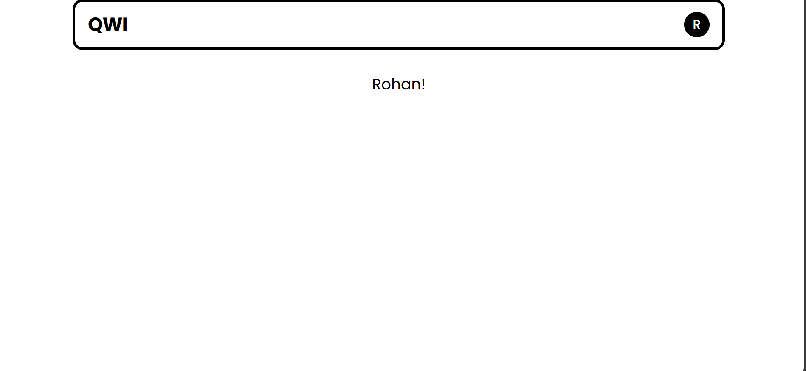
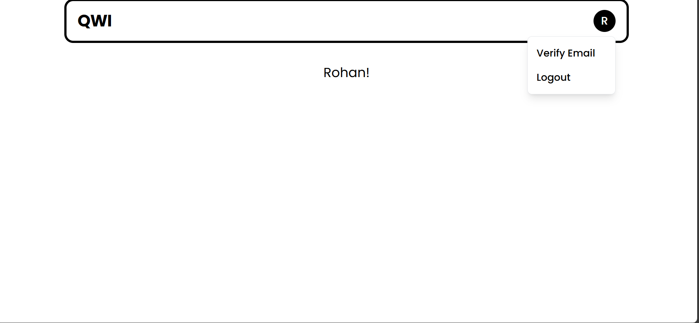

# Secure Authentication Web App

## Overview
This is a full-stack web application with a React frontend, FastAPI backend, and MongoDB database. The app provides a secure user authentication system with email verification and OTP-based login for enhanced security.

## Features
- User registration with email, password, and name input.
- Welcome email sent upon successful registration.
- Login with email and password.
- OTP (One-Time Password) sent to the user's email for two-step verification.
- JWT token generation upon login, stored securely in HTTP-only cookies to protect against CSRF and XSS attacks.
- User profile page with email verification option and logout functionality.

## Technologies Used
- Frontend: React
- Backend: FastAPI
- Database: MongoDB
- Email service: SMTP 
- Security: JWT, HTTP-only cookies, OTP verification

## How It Works
1. Users register by entering their email, password, and name.
2. A welcome email is sent upon successful registration.
3. Users are redirected to the login page.
4. On login, users provide email and password.
5. An OTP is sent to the registered email for verification.
6. After OTP verification, a JWT token is generated and stored in an HTTP-only cookie.
7. Users access their profile page, where they can verify their email or logout.
8. Rate limiting is applied to some endpoints to enhance security.

-User registration with email, password, and name input.  
  

- Welcome email sent upon successful registration.

- Login with email and password.  

- OTP (One-Time Password) sent to the user's email for two-step verification.
 
- JWT token generation upon login, stored securely in HTTP-only cookies to protect against CSRF and XSS attacks.

- User profile page with email verification option and logout functionality.  
  

-Option of logout and email verification

